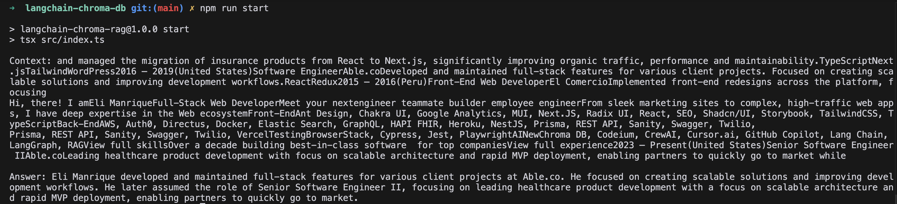

# LangChain + ChromaDB Experiment

This project demonstrates how to build a Q&A system that can answer questions based on the content of someone's personal website. It uses LangChain for document processing and ChromaDB as a vector store to enable semantic search and retrieval.

You can configure which website to scrape and analyze by setting the `WEB_URL` environment variable. By default, it's set to my personal website, but you can change it to any website you want to analyze.

## What's Inside 🔍

- Basic document processing with LangChain
- Playing around with ChromaDB as a vector store
- Some web scraping stuff
- Docker setup (because who wants to install everything locally?)

## If You Want to Try It 🛠️

You'll need:
- Node.js (v20.3.0+)
- Docker + Docker Compose
- Some TypeScript knowledge

## Quick Start

1. Get the code:
```bash
git clone <your-repo-url>
cd langchain-chroma-db
```

2. Install stuff:
```bash
npm install
```

3. Set up your env:
```bash
cp .env.example .env
# Edit .env with your settings
```

4. Fire up ChromaDB:
```bash
docker-compose up -d
```

You can view and explore your vector database at http://localhost:8000
Note: There is no auth, but can be changed if you set the proper configuration https://docs.trychroma.com/production/administration/auth

## Running Things 🏃‍♂️

Scrape the website:
```bash
npm run scrape
```

Ingest some docs:
```bash
npm run ingest
```

Run it:
```bash
npm run start
```

## Project Structure

```
├── src/
│   ├── index.ts        # Main stuff
│   ├── ingest.ts       # Document processing
│   └── scraper.ts      # Web scraping
├── data/               # Where the docs live
├── docker-compose.yml  # Docker config
└── .env               # Your settings
```

Feel free to mess around with the code and learn from it! 🧪 

## Deployment 🚀

You have several options to deploy this project:

### ChromaDB Instance
The easiest way to deploy ChromaDB is using [Railway's Chroma template](https://railway.com/template/tifygm).

### Node.js Application
For the Node.js application, you can deploy to:
- Heroku: Great for production use
- Vercel: Perfect for testing (free tier available)
- Any other Node.js hosting platform

Remember to:
1. Set up your environment variables
2. Configure the ChromaDB connection URL
3. Ensure your Node.js version matches the project requirements


##Demo

